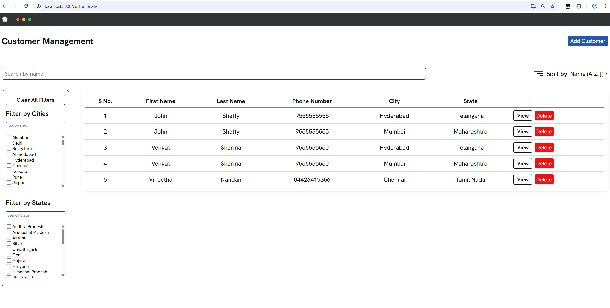
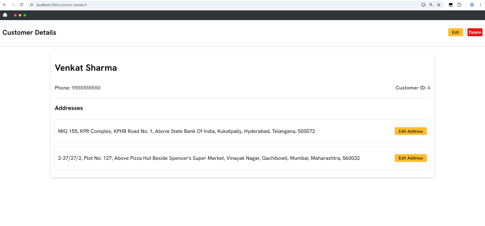
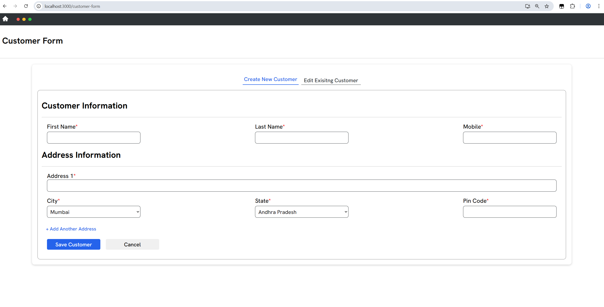
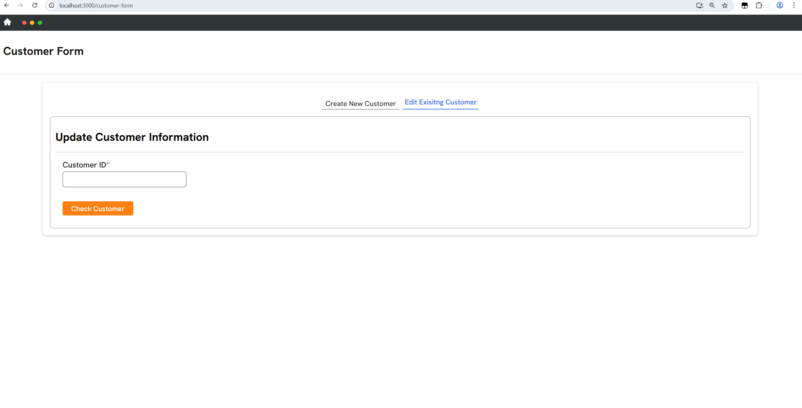

# Tech Assignment - Customer Management App 
A full-stack web application for managing **customers and their addresses**.
Built using **React** for the frontend, **Node.js + Express** for the backend, and **SQLite** as the database.

## 🛠 Tools & Libraries Used

### 🖥️ Frontend


- React.js (with Class Components)
- CSS (Responsive styling)
- React Router for navigation
- React Icons
- React Pop-up (for modals)
- axios (API calls)

### 🌐 Backend


- Node.js
- Express.js
- CORS (cross-origin requests)
- sqlite3 (database access)
- nodemon (auto-reload for server)

### 💽 Database


- SQLite database (`customersInfo.db`).
- Created and managed using the **SQLite CLI**.
- Accessed in backend via **sqlite3** and **sqlite** packages.

`customersInfo.db` has two tables: one for `customers` and one for their `addresses`.

### `customers` Table Schema


| Column      | Type    | Constraints               | Description              |
|-------------|---------|---------------------------|--------------------------|
| id          | INTEGER | PRIMARY KEY AUTOINCREMENT | Unique identifier        |
| first_name  | TEXT    | NOT NULL                  | Customer's first name    |
| last_name   | TEXT    | NOT NULL                  | Customer's last name     |
| phone_number| TEXT    | NOT NULL UNIQUE           | Customer's phone number  |

---

### `addresses` Table Schema

| Column         | Type    | Constraints               | Description              |
|----------------|---------|---------------------------|--------------------------|
| id             | INTEGER | PRIMARY KEY AUTOINCREMENT | Unique identifier        |
| customer_id    | INTEGER | FOREIGN KEY (customers)   | Links to the customer    |
| address_details| TEXT    | NOT NULL                  | Street, building, etc.   |
| city           | TEXT    | NOT NULL                  | City name                |
| state          | TEXT    | NOT NULL                  | State name               |
| pin_code       | TEXT    | NOT NULL                  | Postal/ZIP code          |


👉 **One-to-Many Relationship**: one customer can have multiple addresses.


## 📂 Folder Structure
```
customer-management-app/
│
├── client/                 # React frontend
│   |
│   ├── src/
│       ├── components/     # UI Components
│       │   ├── Banner/
│       │   ├── CreateCustomerForm/
│       │   ├── CustomerDetailsPage/
│       │   ├── CustomerFormPage/
│       │   ├── CustomerListPage/
│       │   ├── EditAndDeletePopUp/
│       │   ├── EditCustomerForm/
│       │   └── FiltersGroup/
│       ├── Data/           # Shared data (cities, states)
│       ├── App.js          # React root entry point
│
│   
│   
│
├── server/                 # Node.js backend
│   ├── customersInfo.db    # SQLite database
│   ├── index.js            # Express server
│   ├── index.http          # API test requests 
│
│
└── README.md
```

## 📸 Screenshots

- Customers List Page



- Customer Details Page



- Customers Form Page
  - To Create New Customer

  

  - To Edit Existing Customer

  
  

## ✨ Key Feature

### 📋 Customer List Page  
- Displays a **list of all customers** with their basic details.  
- Provides quick **navigation to individual customer profiles**.  
- Supports **searching, sorting, and filtering** based on available criteria.  
- Clean **tabular layout** for better readability.  

---
### 👤 Customer Details Page  
- Displays **customer profile information** (name, phone number, customer ID).  
- Shows all **saved addresses** for the customer in a clean card layout.  
- **Single vs Multiple Address Handling**:  
  - If a customer has only one address → shows a caution as **"Only One Address"**.  
  - If a customer has multiple addresses → all addresses are displayed in a list.  
- **Edit Address** option available for each address individually.  
- **Edit (Customer)** and **Delete (Customer)** buttons implemented using **React Popup**.    

---
### 📝 Customer Form Page  
- Contains **two tabs** for handling customer data:  
  1. **Create Customer Tab** – Add a new customer with personal details and one or multiple addresses.  
  2. **Edit Customer Tab** – Update details of an existing customer, including their saved addresses.  
- Provides **form validations** (e.g., required fields like phone number, city, state, etc.).

---
### ✏️ Edit & Delete Pop-ups  
- Implemented using the **react-popup** library.  
- **Edit Pop-up**:  
  - Enables modifying customer details or individual addresses.  
  - Pre-fills form fields for a better user experience.  
- **Delete Confirmation Pop-up**:  
  - Ensures customers/addresses are not removed accidentally.  
  - Displays a confirmation message before final deletion.  
  - On confirmation, deletes the record and **redirects to the Customers List Page**.

## 🚀 How to Run the Project

1. Clone the Repository

    ```
    git clone https://github.com/Vinay-Sathupati/customer-management-app.git

    cd customer-management-app
    ```

2. Backend Setup (Server)

    ```
    cd server

    npm install

    nodemon index.js
    ```


    Starts the Express server at http://localhost:5000/.

    Uses customersInfo.db as the SQLite database.

3. Frontend Setup (Client)

    Open a new terminal and run:

    ```
    cd client

    npm install

    npm start
    ```

    Starts the React app at http://localhost:3000/.

    Communicates with the backend API for CRUD operations.